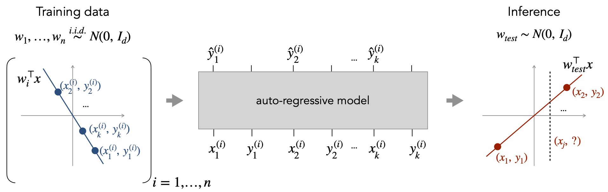

This repository contains the code and models for our paper:

**What Can Transformers Learn In-Context? A Case Study of Simple Function Classes** <br>
*Shivam Garg\*, Dimitris Tsipras\*, Percy Liang, Gregory Valiant* <br>
Paper: http://arxiv.org/abs/2208.01066 <br><br>



```bibtex
    @InProceedings{garg2022what,
        title={What Can Transformers Learn In-Context? A Case Study of Simple Function Classes},
        author={Shivam Garg and Dimitris Tsipras and Percy Liang and Gregory Valiant},
        year={2022},
        booktitle={arXiv preprint}
    }
```

## Getting started
You can start by cloning our repository and following the steps below.

1. Install the dependencies for our code using Conda. You may need to adjust the environment YAML file depending on your setup.

    ```
    conda env create -f environment.yml
    conda activate in-context-learning
    ```

2. Download [model checkpoints](https://github.com/dtsip/in-context-learning/releases/download/initial/models.zip) and extract them in the current directory.

    ```
    wget https://github.com/dtsip/in-context-learning/releases/download/initial/models.zip
    unzip models.zip
    ```

3. [Optional] If you plan to train, populate `conf/wandb.yaml` with you wandb info.

That's it! You can now explore our pre-trained models or train your own. The key entry points
are as follows (starting from `src`):
- The `eval.ipynb` notebook contains code to load our own pre-trained models, plot the pre-computed metrics, and evaluate them on new data.
- `train.py` takes as argument a configuration yaml from `conf` and trains the corresponding model. You can try `python train.py --config conf/toy.yaml` for a quick training run.

## Dependent-data benign-overfitting experiments

The extension in this fork adds stationary AR(1) and change-point Gaussian
contexts while keeping every feature marginal equal to `N(0, I)`. It uses
amplitude SNR (`noise_std = 1 / SNR`) and scales task weights so expected
signal power stays one when dimension changes.

- `src/conf/bo_iid.yaml`, `bo_markov.yaml`, and `bo_change_point.yaml` are
  matched-distribution training examples.
- `src/bo_experiment.py` evaluates fixed noisy contexts with minimum-norm OLS,
  ridge, oracle GLS, and optional Transformer checkpoints.
- `src/bo_eval.py` separates noisy-context fit, clean-query MSE, duplicate
  retrieval, and a held-out linear probe of the Transformer's implied weight.
- `src/bo_plot.py` produces SNR curves, phase heatmaps, effective-rank views,
  and observed critical-SNR brackets without extrapolating unsampled points.
- `src/bo_matrix.py` expands deterministic scientific groups, assigns stable
  semantic experiment IDs, and writes JSON/CSV manifests.
- `src/bo_matrix_train.py` adds checkpoint reuse, resume/skip state, failure
  logs, per-experiment locks, and bounded multi-process concurrency.
- `src/bo_matrix_eval.py` keeps dependence-matched and dependence-shift jobs
  separate while sharing compatible classical-baseline evaluations.
- `src/bo_architecture.py`, `src/bo_architecture_runner.py`, and
  `src/bo_mechanism.py` implement architecture families, instantiated
  parameter matching, and evaluation-only online attention summaries.
- `src/run_bo_suite.py` exposes both the original commands and the matrix
  workflow from any repository checkout.
- `src/conf/bo_sweep_phase.yaml` is the stationary feature-dependence grid;
  the noise and forward/reverse change-point files isolate the other protocols.
  These coarse grids skip linear probes. `bo_plot.py` writes
  `boundary_suggestions.json`, which the architecture evaluator can consume
  directly without assuming a monotone phase curve.

Run the small baseline protocol from the repository root:

```
python src/bo_experiment.py --config src/conf/bo_sweep.yaml --output results/bo_smoke.json
python src/bo_plot.py results/bo_smoke.json --out-dir results/bo_figures
```

Preview the deterministic experiment groups without training:

```bash
python src/run_bo_suite.py plan --group canonical
python src/run_bo_suite.py plan --group stage0
python src/run_bo_suite.py plan --group matched_rho
python src/run_bo_suite.py plan --group dimension
python src/run_bo_suite.py plan --group architecture
python src/run_bo_suite.py train-matrix --group canonical --device cuda:0 --dry-run
```

See `SERVER.md` for the current-CUDA environment and batch commands on a compute server. The
measurement definitions and staged scientific protocol are in `EXPERIMENTS.md`.

# Maintainers
* [Shivam Garg](https://cs.stanford.edu/~shivamg/)
* [Dimitris Tsipras](https://dtsipras.com/)
